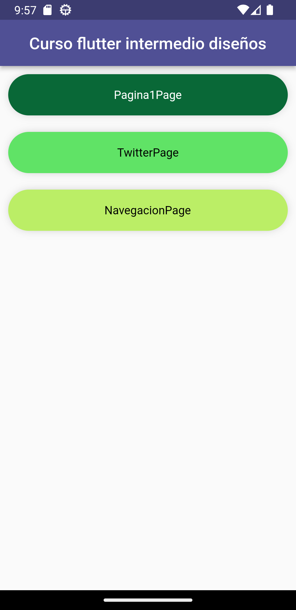
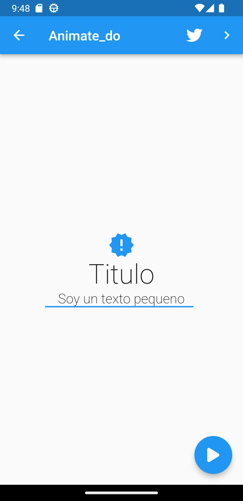
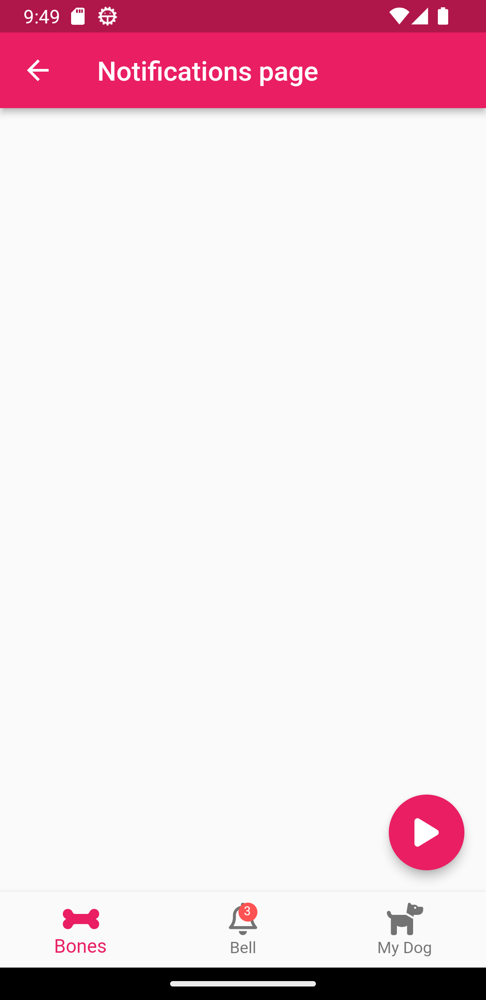

# animate_do_app

This project is a practice for the use of animations in flutter. Specifically this time it is done with the animate_do package found in pub.dev. There are 3 screens and in 2 of them the entrance animations to the twitter application are simulated, and in the last one there is an animation of the notification icon falling down.

Also curious detail that every time the application is entered the colors change randomly and the color of the texts adapts to those colors to be more legible.

  
  
  
  

# twitter-animate-do
